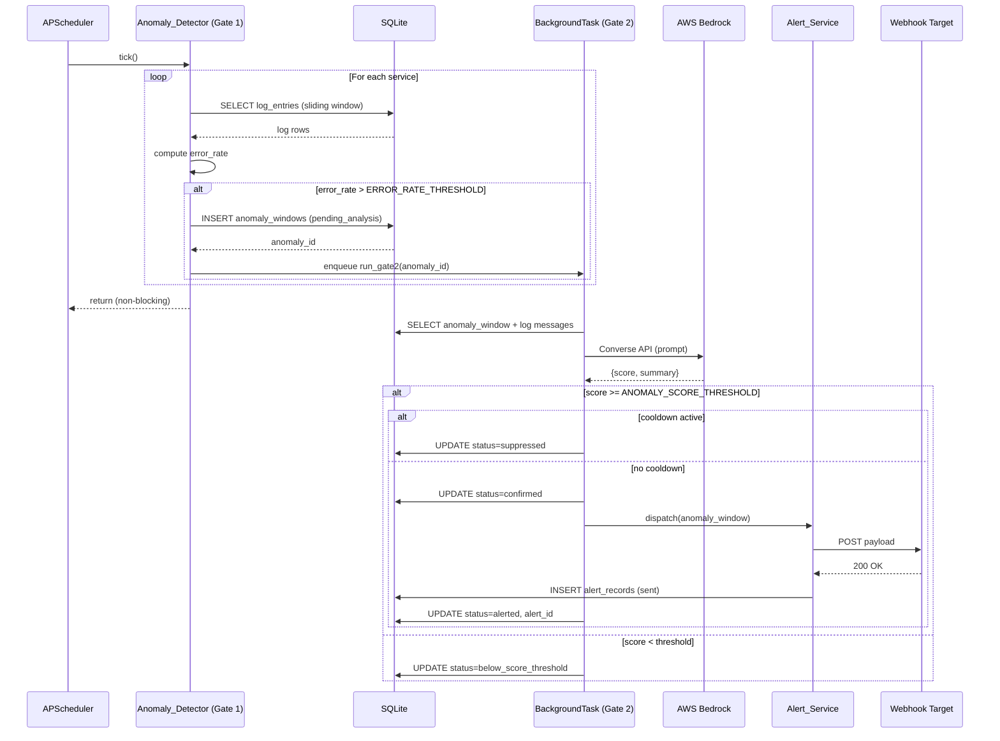

# SRE Watchdog — Design Document

## Overview

The SRE Watchdog is a Python 3.11+ API-first observability platform built on FastAPI. It ingests structured application logs, detects anomalies via a two-gate statistical + AI pipeline, dispatches webhook alerts, and visualises service health on a Jinja2/Chart.js dashboard. All remote AI inference is handled by AWS Bedrock (Claude Sonnet 4.5 via the Converse API). The system is designed for local execution with remote AWS calls and is structured for future containerised deployment on ECS/Fargate.

### Key Design Goals

- **Non-blocking detection**: APScheduler Gate 1 tick completes synchronously; Bedrock latency is absorbed by FastAPI BackgroundTasks.
- **Full audit trail**: Every Anomaly_Window carries its complete lifecycle disposition from creation through alert dispatch or suppression.
- **12-factor configuration**: All tuneable values live in `.env`; no hardcoded thresholds or secrets.
- **Testability**: Pure-function core logic, dependency injection for external clients, and a comprehensive pytest suite with property-based tests.

---

## 1. System Architecture Overview

```mermaid
graph TD
    subgraph Clients
        CLI[generate_logs.py CLI]
        EXT[External Services / On-call Tools]
        BROWSER[SRE Browser]
    end

    subgraph FastAPI Application
        INGEST[POST /logs/ingest]
        LOGS[GET /logs]
        ANALYZE[POST /analyze]
        ANALYZE_POLL[GET /analyze/{job_id}]
        ANOMALIES[GET /anomalies]
        ANOMALY_DETAIL[GET /anomalies/{id}]
        ALERTS[GET /alerts]
        HEALTH[GET /health]
        METRICS[GET /metrics]
        ECHO[POST /webhooks/echo]
        DASHBOARD[GET /dashboard]
        BG_TASKS[FastAPI BackgroundTasks]
        JOB_STORE[In-Memory Job Store dict]
    end

    subgraph Scheduler
        APSCHEDULER[APScheduler IntervalJob\nDETECTION_INTERVAL_SECONDS]
    end

    subgraph Core Services
        LOG_SVC[Log_Ingestion_Service]
        DETECTOR[Anomaly_Detector\nGate 1 — Statistical Pre-filter]
        BEDROCK_CLIENT[Bedrock_Client\nGate 2 — AI Analysis]
        ALERT_SVC[Alert_Service]
        DASH_SVC[Dashboard_Service]
    end

    subgraph Persistence
        SQLITE[(SQLite WAL\nlog_entries\nanomaly_windows\nalert_records\nwebhook_echo_log)]
    end

    subgraph AWS
        BEDROCK[AWS Bedrock\nConverse API\nClaude Sonnet 4.5]
    end

    CLI -->|POST /logs/ingest batches| INGEST
    BROWSER -->|HTTP| DASHBOARD
    BROWSER -->|HTTP| ANALYZE
    BROWSER -->|HTTP| ANALYZE_POLL
    EXT -->|receives webhook| ECHO

    INGEST --> LOG_SVC --> SQLITE
    LOGS --> SQLITE
    APSCHEDULER -->|tick every N seconds| DETECTOR
    DETECTOR -->|Gate 1: create pending_analysis| SQLITE
    DETECTOR -->|enqueue BackgroundTask| BG_TASKS
    BG_TASKS -->|Gate 2: invoke| BEDROCK_CLIENT
    BEDROCK_CLIENT -->|Converse API| BEDROCK
    BEDROCK_CLIENT -->|update status| SQLITE
    BG_TASKS -->|if confirmed + no cooldown| ALERT_SVC
    ALERT_SVC -->|POST webhook| EXT
    ALERT_SVC -->|persist alert record| SQLITE
    ANALYZE -->|create job| JOB_STORE
    ANALYZE -->|enqueue BackgroundTask| BG_TASKS
    ANALYZE_POLL --> JOB_STORE
    ANOMALIES --> SQLITE
    ANOMALY_DETAIL --> SQLITE
    ALERTS --> SQLITE
    HEALTH --> SQLITE
    METRICS --> SQLITE
    DASHBOARD --> DASH_SVC --> SQLITE
```

---

## 2. Project Structure

```
sre-watchdog/
├── app/
│   ├── __init__.py                  # Package marker
│   ├── main.py                      # FastAPI app factory, lifespan context manager, router registration
│   ├── config.py                    # pydantic-settings Settings class; reads all env vars; raises ConfigurationError
│   ├── database.py                  # SQLite engine creation, WAL mode pragma, session factory, Base metadata
│   ├── models/
│   │   ├── __init__.py
│   │   ├── db_models.py             # SQLAlchemy ORM models: LogEntry, AnomalyWindow, AlertRecord, WebhookEchoLog
│   │   └── schemas.py               # Pydantic request/response schemas for all endpoints
│   ├── routers/
│   │   ├── __init__.py
│   │   ├── logs.py                  # POST /logs/ingest, GET /logs
│   │   ├── anomalies.py             # GET /anomalies, GET /anomalies/{id}
│   │   ├── analyze.py               # POST /analyze, GET /analyze/{job_id}
│   │   ├── alerts.py                # GET /alerts
│   │   ├── webhooks.py              # POST /webhooks/echo
│   │   ├── health.py                # GET /health
│   │   ├── metrics.py               # GET /metrics
│   │   └── dashboard.py             # GET /dashboard (Jinja2 SSR)
│   ├── services/
│   │   ├── __init__.py
│   │   ├── log_ingestion_service.py # Batch validation, persistence, structured logging
│   │   ├── anomaly_detector.py      # Gate 1 statistical pre-filter; sliding window Error_Rate computation
│   │   ├── bedrock_client.py        # AWS Bedrock Converse API wrapper; prompt construction; response parsing; retry
│   │   ├── alert_service.py         # Severity mapping; webhook dispatch; retry; cooldown check; record persistence
│   │   └── dashboard_service.py     # Aggregation queries for SSR initial render data
│   ├── scheduler.py                 # APScheduler setup; job registration; lifespan integration
│   ├── middleware.py                # Structured JSON request logging middleware (method, path, status, latency)
│   └── templates/
│       └── dashboard.html           # Jinja2 template: Chart.js time-series, anomaly list, alert list, Run Analysis button
├── tests/
│   ├── __init__.py
│   ├── conftest.py                  # pytest fixtures: test DB, test client, mock Bedrock, mock webhook
│   ├── unit/
│   │   ├── __init__.py
│   │   ├── test_anomaly_detector.py # Gate 1/2 logic, cooldown, analysis_failed, status transitions
│   │   ├── test_bedrock_client.py   # Response parsing, BedrockParseError, retry backoff
│   │   ├── test_alert_service.py    # Severity bands, dispatch, retry failure, suppression filtering
│   │   ├── test_config.py           # Env var parsing, ConfigurationError on missing required vars
│   │   └── test_schemas.py          # Log_Entry round-trip property test (Requirement 9.8)
│   └── integration/
│       ├── __init__.py
│       ├── test_ingest.py           # POST /logs/ingest: valid batch, invalid payload, 413, empty batch
│       ├── test_logs.py             # GET /logs: pagination envelope, filters, page/page_size params
│       ├── test_analyze.py          # POST /analyze 202+job_id, GET /analyze/{job_id} polling, completion
│       ├── test_health.py           # GET /health: normal, DB unreachable, bedrock field schema
│       └── test_metrics.py          # GET /metrics: counter accuracy after operations
├── generate_logs.py                 # Standalone CLI: synthetic log generator; 5 services; 3 anomaly windows
├── .env.example                     # All env vars with descriptions and safe defaults
├── requirements.txt                 # Pinned dependencies
├── pytest.ini                       # pytest config: testpaths, cov settings, markers
├── .flake8                          # flake8 config: max-line-length=120, ignore list
├── README.md                        # Setup, configuration, and local startup instructions
└── CONTRIBUTING.md                  # Development workflow, coding standards, test execution
```

---

## 3. Data Models

### 3.1 SQLite Schema

SQLite is opened in WAL mode at init to support concurrent BackgroundTask writes without blocking reads.

```sql
-- Enabled at DB init via PRAGMA journal_mode=WAL;

CREATE TABLE log_entries (
    id            INTEGER PRIMARY KEY AUTOINCREMENT,
    timestamp     TEXT    NOT NULL,          -- ISO 8601, stored as TEXT for SQLite compatibility
    service       TEXT    NOT NULL,          -- one of the 5 named services
    level         TEXT    NOT NULL,          -- DEBUG | INFO | WARNING | ERROR | CRITICAL
    message       TEXT    NOT NULL,
    ingested_at   TEXT    NOT NULL DEFAULT (strftime('%Y-%m-%dT%H:%M:%fZ', 'now'))
);

CREATE INDEX idx_log_entries_service_timestamp ON log_entries (service, timestamp);
CREATE INDEX idx_log_entries_level             ON log_entries (level);
CREATE INDEX idx_log_entries_timestamp         ON log_entries (timestamp);

CREATE TABLE anomaly_windows (
    id                  INTEGER PRIMARY KEY AUTOINCREMENT,
    service             TEXT    NOT NULL,
    window_start        TEXT    NOT NULL,    -- ISO 8601
    window_end          TEXT    NOT NULL,    -- ISO 8601
    error_rate          REAL    NOT NULL,    -- 0.0–1.0
    anomaly_score       REAL,               -- NULL until Gate 2 completes
    status              TEXT    NOT NULL,    -- pending_analysis | confirmed | below_score_threshold |
                                             -- analysis_failed | alerted | suppressed
    suppression_reason  TEXT,               -- cooldown_active | orphaned_on_restart | NULL
    ai_summary          TEXT,               -- plain-text summary from Bedrock; NULL until Gate 2
    failure_reason      TEXT,               -- populated on analysis_failed
    alert_id            INTEGER REFERENCES alert_records(id),
    created_at          TEXT    NOT NULL DEFAULT (strftime('%Y-%m-%dT%H:%M:%fZ', 'now')),
    updated_at          TEXT    NOT NULL DEFAULT (strftime('%Y-%m-%dT%H:%M:%fZ', 'now'))
);

CREATE INDEX idx_anomaly_windows_service        ON anomaly_windows (service);
CREATE INDEX idx_anomaly_windows_status         ON anomaly_windows (status);
CREATE INDEX idx_anomaly_windows_created_at     ON anomaly_windows (created_at);

CREATE TABLE alert_records (
    id               INTEGER PRIMARY KEY AUTOINCREMENT,
    anomaly_id       INTEGER NOT NULL REFERENCES anomaly_windows(id),
    dispatched_at    TEXT    NOT NULL DEFAULT (strftime('%Y-%m-%dT%H:%M:%fZ', 'now')),
    webhook_url      TEXT    NOT NULL,
    payload          TEXT    NOT NULL,   -- JSON blob of the full webhook payload
    http_status      INTEGER,            -- NULL if dispatch was suppressed or failed before response
    dispatch_status  TEXT    NOT NULL,   -- sent | failed | suppressed
    severity         TEXT    NOT NULL    -- LOW | MEDIUM | HIGH | CRITICAL
);

CREATE INDEX idx_alert_records_anomaly_id    ON alert_records (anomaly_id);
CREATE INDEX idx_alert_records_dispatched_at ON alert_records (dispatched_at);

CREATE TABLE webhook_echo_log (
    id           INTEGER PRIMARY KEY AUTOINCREMENT,
    received_at  TEXT    NOT NULL DEFAULT (strftime('%Y-%m-%dT%H:%M:%fZ', 'now')),
    payload      TEXT    NOT NULL    -- raw JSON body received at /webhooks/echo
);
```

### 3.2 Pydantic Schemas (`app/models/schemas.py`)

```python
# --- Enums ---

class LogLevel(str, Enum):
    DEBUG    = "DEBUG"
    INFO     = "INFO"
    WARNING  = "WARNING"
    ERROR    = "ERROR"
    CRITICAL = "CRITICAL"

class AnomalyStatus(str, Enum):
    PENDING_ANALYSIS      = "pending_analysis"
    CONFIRMED             = "confirmed"
    BELOW_SCORE_THRESHOLD = "below_score_threshold"
    ANALYSIS_FAILED       = "analysis_failed"
    ALERTED               = "alerted"
    SUPPRESSED            = "suppressed"

class AlertDispatchStatus(str, Enum):
    SENT       = "sent"
    FAILED     = "failed"
    SUPPRESSED = "suppressed"

class SeverityLabel(str, Enum):
    LOW      = "LOW"
    MEDIUM   = "MEDIUM"
    HIGH     = "HIGH"
    CRITICAL = "CRITICAL"

class BedrockHealthStatus(str, Enum):
    OK       = "ok"
    DEGRADED = "degraded"
    UNKNOWN  = "unknown"

# --- Log Ingestion ---

class LogEntryCreate(BaseModel):
    timestamp: datetime          # ISO 8601; validated by Pydantic
    service:   str               # must be one of the 5 named services
    level:     LogLevel
    message:   str

class LogEntryResponse(LogEntryCreate):
    id:          int
    ingested_at: datetime

class IngestRequest(BaseModel):
    entries: List[LogEntryCreate]

class IngestResponse(BaseModel):
    accepted: int
    rejected: int
    errors:   List[str]

class PaginatedLogsResponse(BaseModel):
    total_count: int
    page:        int
    page_size:   int
    has_more:    bool
    data:        List[LogEntryResponse]

# --- Anomaly Windows ---

class AnomalyWindowResponse(BaseModel):
    id:                 int
    service:            str
    window_start:       datetime
    window_end:         datetime
    error_rate:         float
    anomaly_score:      Optional[float]
    status:             AnomalyStatus
    suppression_reason: Optional[str]
    ai_summary:         Optional[str]
    failure_reason:     Optional[str]
    alert_id:           Optional[int]
    created_at:         datetime
    updated_at:         datetime

# --- Analyze Job ---

class AnalyzeRequest(BaseModel):
    service:    Optional[str] = None   # omit = all 5 services
    start_time: datetime
    end_time:   datetime

class AnalyzeJobStatus(str, Enum):
    PENDING   = "pending"
    RUNNING   = "running"
    COMPLETED = "completed"
    FAILED    = "failed"

class AnalyzeResponse(BaseModel):
    job_id:  str
    status:  AnalyzeJobStatus = AnalyzeJobStatus.PENDING

class AnalyzeJobResult(BaseModel):
    job_id:           str
    status:           AnalyzeJobStatus
    anomalies_found:  Optional[int]
    alerts_dispatched: Optional[int]
    error:            Optional[str]
    completed_at:     Optional[datetime]

# --- Alerts ---

class AlertRecordResponse(BaseModel):
    id:              int
    anomaly_id:      int
    dispatched_at:   datetime
    webhook_url:     str
    payload:         dict
    http_status:     Optional[int]
    dispatch_status: AlertDispatchStatus
    severity:        SeverityLabel

# --- Health ---

class BedrockHealthDetail(BaseModel):
    status:          BedrockHealthStatus
    last_checked_at: Optional[datetime]
    message:         str

class HealthResponse(BaseModel):
    status:   str          # "ok" | "degraded"
    database: str          # "ok" | "unreachable"
    bedrock:  BedrockHealthDetail

# --- Metrics ---

class MetricsResponse(BaseModel):
    total_logs_ingested:       int
    total_anomalies_detected:  int
    total_alerts_dispatched:   int
    total_failed_alerts:       int
    total_analysis_failed:     int
    total_cooldown_suppressed: int

# --- Webhook Echo ---

class WebhookEchoResponse(BaseModel):
    received_at: datetime
    payload:     dict
```

---

## 4. API Endpoint Catalogue

| # | Method | Path | Request | Response | Status Codes |
|---|--------|------|---------|----------|--------------|
| 1 | POST | `/logs/ingest` | `IngestRequest` (JSON body) | `IngestResponse` | 200, 413, 422 |
| 2 | GET | `/logs` | Query: `page`, `page_size`, `service`, `level`, `start_time`, `end_time` | `PaginatedLogsResponse` | 200, 422 |
| 3 | POST | `/analyze` | `AnalyzeRequest` (JSON body) | `AnalyzeResponse` (202) | 202, 422 |
| 4 | GET | `/analyze/{job_id}` | Path: `job_id` | `AnalyzeJobResult` | 200, 404 |
| 5 | GET | `/anomalies` | Query: `service`, `status`, `page`, `page_size` | `List[AnomalyWindowResponse]` | 200 |
| 6 | GET | `/anomalies/{id}` | Path: `id` | `AnomalyWindowResponse` | 200, 404 |
| 7 | GET | `/alerts` | Query: `page`, `page_size` | `List[AlertRecordResponse]` | 200 |
| 8 | POST | `/webhooks/echo` | Any JSON body | `WebhookEchoResponse` | 200 |
| 9 | GET | `/health` | — | `HealthResponse` | 200, 503 |
| 10 | GET | `/metrics` | — | `MetricsResponse` | 200 |
| 11 | GET | `/dashboard` | — | HTML (Jinja2) | 200 |

### Endpoint Details

**POST /logs/ingest**
- Validates each entry against `LogEntryCreate` schema.
- Returns 413 with body `{"error": "Batch too large", "limit": 500, "received": N}` if `len(entries) > MAX_INGEST_BATCH_SIZE`.
- Returns 422 with Pydantic validation error detail for schema failures.
- Persists all valid entries atomically in a single DB transaction.

**GET /logs**
- `page` default 1, `page_size` default 100 max 500.
- `start_time` / `end_time` filter on `log_entries.timestamp`.
- `total_count` reflects the filtered count (not total table size).
- `has_more` = `page * page_size < total_count`.

**POST /analyze**
- Returns HTTP 202 immediately with `{"job_id": "<uuid>", "status": "pending"}`.
- Enqueues a FastAPI BackgroundTask that runs Gate 2 analysis for the specified service(s) and time range.
- Job state stored in `app.state.analyze_jobs: dict[str, AnalyzeJobResult]` (in-memory; not durable across restarts — documented).

**GET /analyze/{job_id}**
- Returns 404 if `job_id` not found in in-memory store.
- Status transitions: `pending` → `running` → `completed` | `failed`.

**GET /health**
- Performs a lightweight `SELECT 1` against SQLite to verify DB connectivity.
- Returns 503 if DB check fails, with `{"status": "degraded", "database": "unreachable", ...}`.
- `bedrock.status` is `unknown` until the first real inference call completes.

**POST /webhooks/echo**
- Accepts any valid JSON body.
- Persists raw payload to `webhook_echo_log` table.
- Returns `{"received_at": "<iso8601>", "payload": <echoed body>}`.

---

## 5. Detection Pipeline Design

### 5.1 Two-Gate Architecture

```
APScheduler tick (every DETECTION_INTERVAL_SECONDS)
│
├─ For each of 5 services (synchronous loop):
│   ├─ Query log_entries WHERE service=S AND timestamp >= now - SLIDING_WINDOW_MINUTES
│   ├─ Compute error_rate = (ERROR + CRITICAL count) / total count
│   ├─ IF error_rate > ERROR_RATE_THRESHOLD:
│   │   ├─ INSERT anomaly_windows (status=pending_analysis)
│   │   └─ Enqueue FastAPI BackgroundTask(run_gate2, anomaly_id)
│   └─ (else: no action)
│
└─ Tick returns immediately (never awaits Bedrock)

BackgroundTask: run_gate2(anomaly_id)  [may run concurrently for different services]
│
├─ Fetch anomaly_window record
├─ Fetch log messages for the window
├─ Call bedrock_client.analyze(service, window, error_rate, log_messages)
│   ├─ On success: extract anomaly_score, ai_summary
│   │   ├─ IF anomaly_score >= ANOMALY_SCORE_THRESHOLD:
│   │   │   ├─ Check cooldown: last alerted_at for service within ALERT_COOLDOWN_MINUTES?
│   │   │   ├─ IF cooldown active:
│   │   │   │   └─ UPDATE status=suppressed, suppression_reason=cooldown_active
│   │   │   └─ IF no cooldown:
│   │   │       ├─ UPDATE status=confirmed
│   │   │       └─ Call alert_service.dispatch(anomaly_window)
│   │   │           ├─ On success: UPDATE status=alerted, alert_id=<id>
│   │   │           └─ On failure: alert_record.dispatch_status=failed
│   │   └─ IF anomaly_score < ANOMALY_SCORE_THRESHOLD:
│   │       └─ UPDATE status=below_score_threshold
│   └─ On exception (BedrockParseError, ClientError, timeout):
│       └─ UPDATE status=analysis_failed, failure_reason=<str>
```

### 5.2 Sequence Diagram



### 5.3 Startup Cleanup

On application startup (inside the `lifespan` context manager, before the scheduler starts):

```python
# Mark stale pending_analysis records as analysis_failed
cutoff = datetime.utcnow() - timedelta(minutes=10)
db.query(AnomalyWindow).filter(
    AnomalyWindow.status == "pending_analysis",
    AnomalyWindow.created_at < cutoff
).update({
    "status": "analysis_failed",
    "suppression_reason": "orphaned_on_restart",
    "failure_reason": "Application restarted before Gate 2 completed"
})
```

---

## 6. Bedrock Integration Design

### 6.1 Client Interface (`app/services/bedrock_client.py`)

```python
class BedrockClient:
    def analyze(
        self,
        service: str,
        window_start: datetime,
        window_end: datetime,
        error_rate: float,
        log_messages: List[str],
    ) -> BedrockAnalysisResult:
        """Invoke Bedrock Converse API and return parsed result."""
        ...

@dataclass
class BedrockAnalysisResult:
    anomaly_score: float    # 0.0–1.0
    summary:       str      # plain-text explanation
    input_tokens:  int
    output_tokens: int
    latency_ms:    float
```

### 6.2 Prompt Template

```
You are an SRE anomaly analysis assistant. Analyse the following log data and respond in the exact JSON format specified.

Service: {service}
Time Window: {window_start} to {window_end} (UTC)
Error Rate: {error_rate:.1%} ({error_count} errors out of {total_count} log entries)

Log Messages (most recent {sample_size} entries):
{log_messages_block}

Respond with ONLY valid JSON in this exact format — no markdown, no explanation outside the JSON:
{{
  "anomaly_score": <float between 0.0 and 1.0>,
  "summary": "<one to three sentence plain-text explanation of the anomaly pattern>"
}}

Scoring guide:
- 0.0–0.39: Low severity — isolated errors, likely transient
- 0.40–0.69: Medium severity — degraded service, warrants investigation
- 0.70–0.89: High severity — significant service impact, escalate
- 0.90–1.0:  Critical severity — service failure or cascade, immediate action required
```

**Design decisions:**
- Log messages are capped at 50 entries (most recent) to control token cost. The cap is configurable via `BEDROCK_MAX_LOG_SAMPLE` env var.
- The prompt requests JSON-only output to simplify parsing and reduce hallucination risk.
- `error_rate` is formatted as a percentage string for human readability in the prompt.

### 6.3 Response Parsing Strategy

```python
def _parse_response(self, raw_response: dict) -> tuple[float, str]:
    """Extract anomaly_score and summary from Bedrock Converse response.

    Raises:
        BedrockParseError: If the response cannot be parsed into the expected structure.
    """
    try:
        content_text = raw_response["output"]["message"]["content"][0]["text"]
        parsed = json.loads(content_text)
        score = float(parsed["anomaly_score"])
        summary = str(parsed["summary"])
        if not (0.0 <= score <= 1.0):
            raise BedrockParseError(f"anomaly_score {score} out of range [0.0, 1.0]")
        return score, summary
    except (KeyError, json.JSONDecodeError, TypeError, ValueError) as exc:
        raise BedrockParseError(f"Failed to parse Bedrock response: {exc}") from exc
```

### 6.4 Retry Logic

```python
MAX_RETRIES = 3
RETRY_BASE_DELAY_SECONDS = 1.0   # doubles each attempt: 1s, 2s, 4s

RETRYABLE_ERROR_CODES = {
    "ThrottlingException",
    "ServiceUnavailableException",
    "ModelTimeoutException",
}

for attempt in range(MAX_RETRIES):
    try:
        response = self._client.converse(...)
        break
    except ClientError as exc:
        error_code = exc.response["Error"]["Code"]
        if error_code not in RETRYABLE_ERROR_CODES or attempt == MAX_RETRIES - 1:
            raise
        delay = RETRY_BASE_DELAY_SECONDS * (2 ** attempt)
        time.sleep(delay)
```

### 6.5 Bedrock Health Caching

```python
# Stored in app.state (set during lifespan startup)
app.state.bedrock_health = {
    "status": "unknown",          # ok | degraded | unknown
    "last_checked_at": None,      # datetime | None
    "message": "No inference calls made yet"
}

# Updated after every real inference call (success or failure)
# in bedrock_client.analyze() — never via synthetic health-check calls
```

### 6.6 Startup Credential Check

```python
# In lifespan context manager, before scheduler starts
session = boto3.Session()
credentials = session.get_credentials()
if credentials is None:
    logger.warning("AWS credentials not found. Bedrock calls will fail.")
    app.state.bedrock_health["status"] = "degraded"
    app.state.bedrock_health["message"] = "No AWS credentials found at startup"
```

---

## 7. Alert Dispatch Design

### 7.1 Severity Mapping

| Anomaly_Score Range | Severity Label |
|---------------------|----------------|
| 0.00 – 0.39         | `LOW`          |
| 0.40 – 0.69         | `MEDIUM`       |
| 0.70 – 0.89         | `HIGH`         |
| 0.90 – 1.00         | `CRITICAL`     |

```python
def map_severity(score: float) -> SeverityLabel:
    """Map a numeric anomaly score to a severity label."""
    if score <= 0.39:
        return SeverityLabel.LOW
    elif score <= 0.69:
        return SeverityLabel.MEDIUM
    elif score <= 0.89:
        return SeverityLabel.HIGH
    return SeverityLabel.CRITICAL
```

### 7.2 Webhook Payload Schema

```json
{
  "alert_timestamp": "2025-01-15T14:32:00Z",
  "anomaly_id": 42,
  "service": "payment-service",
  "window_start": "2025-01-15T14:26:00Z",
  "window_end": "2025-01-15T14:32:00Z",
  "error_rate": 0.67,
  "anomaly_score": 0.85,
  "severity": "HIGH",
  "ai_summary": "Payment service experienced a sharp spike in ERROR-level logs over 6 minutes, consistent with a payment processor connection failure. 67% of requests failed with timeout errors."
}
```

### 7.3 Dispatch Logic and Retry

```python
MAX_DISPATCH_RETRIES = 3
DISPATCH_TIMEOUT_SECONDS = 10

for attempt in range(MAX_DISPATCH_RETRIES):
    try:
        response = httpx.post(
            url=settings.WEBHOOK_URL,
            json=payload,
            timeout=DISPATCH_TIMEOUT_SECONDS
        )
        response.raise_for_status()
        # Record success
        alert_record.dispatch_status = "sent"
        alert_record.http_status = response.status_code
        break
    except (httpx.HTTPError, httpx.TimeoutException) as exc:
        if attempt == MAX_DISPATCH_RETRIES - 1:
            logger.error("Webhook dispatch failed after %d retries: %s", MAX_DISPATCH_RETRIES, exc)
            alert_record.dispatch_status = "failed"
```

### 7.4 Cooldown Logic

```python
def is_in_cooldown(service: str, db: Session) -> bool:
    """Check if the service has an alerted anomaly within the cooldown window."""
    cutoff = datetime.utcnow() - timedelta(minutes=settings.ALERT_COOLDOWN_MINUTES)
    return db.query(AnomalyWindow).filter(
        AnomalyWindow.service == service,
        AnomalyWindow.status == AnomalyStatus.ALERTED,
        AnomalyWindow.updated_at >= cutoff
    ).first() is not None
```

**Cooldown behaviour summary:**
- Cooldown check happens in Gate 2 BackgroundTask, after Bedrock returns a score ≥ threshold.
- If cooldown is active: status → `suppressed`, `suppression_reason` → `cooldown_active`. An `alert_records` row is created with `dispatch_status=suppressed`. No HTTP POST is made.
- If cooldown is not active: status → `confirmed`, alert dispatched, status → `alerted` on success.
- Records with `analysis_failed` or `below_score_threshold` are never passed to `Alert_Service`.

### 7.5 Suppressed Alert Record

Even when cooldown is active, an `alert_records` row is created for full audit trail:

```python
alert_record = AlertRecord(
    anomaly_id=anomaly_window.id,
    webhook_url=settings.WEBHOOK_URL,
    payload=json.dumps(payload),
    http_status=None,
    dispatch_status=AlertDispatchStatus.SUPPRESSED,
    severity=severity
)
```

---

## 8. Dashboard Design

### 8.1 Page Layout

```
┌─────────────────────────────────────────────────────────────────┐
│  SRE Watchdog Dashboard                    [Run Analysis] button │
│  Last updated: <timestamp>   Auto-refresh: 60s                  │
├─────────────────────────────────────────────────────────────────┤
│  METRICS BAR                                                     │
│  Logs Ingested: N  │  Anomalies: N  │  Alerts: N  │  Failed: N  │
├─────────────────────────────────────────────────────────────────┤
│  ERROR RATE TREND (Chart.js line chart — last 24h)              │
│  Y-axis: Error Rate (0–100%)                                    │
│  X-axis: Time (hourly buckets)                                  │
│  One line per service (5 lines, distinct colours)               │
├─────────────────────────────────────────────────────────────────┤
│  RECENT ANOMALIES (last 20)                                     │
│  Service │ Window │ Score │ Status │ Severity │ AI Summary      │
├─────────────────────────────────────────────────────────────────┤
│  RECENT ALERTS (last 20)                                        │
│  Timestamp │ Service │ Severity │ Anomaly ID │ Dispatch Status  │
└─────────────────────────────────────────────────────────────────┘
```

### 8.2 Chart.js Data Shape

The Jinja2 template receives `chart_data` from `dashboard_service.get_chart_data()` on initial SSR load. Client-side refresh re-fetches from `/anomalies` and `/alerts`.

```json
{
  "labels": ["2025-01-15T00:00Z", "2025-01-15T01:00Z", "..."],
  "datasets": [
    {
      "label": "api-gateway",
      "data": [0.05, 0.08, 0.12, "..."],
      "borderColor": "#FF6384",
      "tension": 0.3,
      "fill": false
    },
    {
      "label": "auth-service",
      "data": [0.03, 0.04, 0.67, "..."],
      "borderColor": "#36A2EB",
      "tension": 0.3,
      "fill": false
    }
  ]
}
```

Chart data is computed by bucketing `log_entries` into 1-hour intervals over the past 24 hours and computing `error_rate` per service per bucket. Buckets with no entries default to `0.0`.

### 8.3 Client-Side JavaScript Logic

```javascript
// Auto-refresh every 60 seconds
setInterval(refreshDashboard, 60000);

async function refreshDashboard() {
    const [anomalies, alerts, metrics] = await Promise.all([
        fetch('/anomalies?page_size=20').then(r => r.json()),
        fetch('/alerts?page_size=20').then(r => r.json()),
        fetch('/metrics').then(r => r.json()),
    ]);
    updateAnomalyTable(anomalies);
    updateAlertTable(alerts);
    updateMetricsBar(metrics);
    document.getElementById('last-updated').textContent = new Date().toISOString();
}

// Run Analysis button
document.getElementById('run-analysis-btn').addEventListener('click', async () => {
    const btn = document.getElementById('run-analysis-btn');
    btn.disabled = true;
    btn.textContent = 'Running...';

    const now = new Date();
    const oneHourAgo = new Date(now - 3600000);
    const response = await fetch('/analyze', {
        method: 'POST',
        headers: {'Content-Type': 'application/json'},
        body: JSON.stringify({
            start_time: oneHourAgo.toISOString(),
            end_time: now.toISOString()
            // service omitted → all services
        })
    });
    const { job_id } = await response.json();

    // Poll every 3 seconds
    const pollInterval = setInterval(async () => {
        const jobResult = await fetch(`/analyze/${job_id}`).then(r => r.json());
        if (jobResult.status === 'completed' || jobResult.status === 'failed') {
            clearInterval(pollInterval);
            btn.disabled = false;
            btn.textContent = 'Run Analysis';
            await refreshDashboard();
        }
    }, 3000);
});
```

### 8.4 SSR vs Client-Side Separation

| Concern | Mechanism |
|---------|-----------|
| Initial page load (HTML + chart data) | Jinja2 SSR — `dashboard_service.get_chart_data()` called in route handler |
| Auto-refresh (anomalies, alerts, metrics) | Client-side `fetch` to `/anomalies`, `/alerts`, `/metrics` |
| Run Analysis trigger + polling | Client-side `fetch` to `POST /analyze` + `GET /analyze/{job_id}` |
| No direct DB queries from JavaScript | All data via internal REST API endpoints |

---

## 9. Configuration Design

### 9.1 `.env.example`

```dotenv
# ============================================================
# SRE Watchdog — Environment Configuration
# Copy this file to .env and fill in your values.
# Never commit .env to version control.
# ============================================================

# --- Database ---
# SQLite database file path. WAL mode is enabled automatically at init.
# Type: str | Default: sqlite:///./sre_watchdog.db
DATABASE_URL=sqlite:///./sre_watchdog.db

# --- AWS / Bedrock ---
# AWS region for Bedrock API calls.
# Type: str | Default: us-east-1
AWS_REGION=us-east-1

# Bedrock model ID for anomaly analysis.
# Type: str | Default: us.anthropic.claude-sonnet-4-5-20251101-v1:0
BEDROCK_MODEL_ID=us.anthropic.claude-sonnet-4-5-20251101-v1:0

# Maximum number of log messages sampled per Bedrock prompt (controls token cost).
# Type: int | Default: 50
BEDROCK_MAX_LOG_SAMPLE=50

# --- Detection Thresholds ---
# Error rate (0.0–1.0) above which Gate 1 creates a pending_analysis record.
# Type: float | Default: 0.10  (10% error rate)
ERROR_RATE_THRESHOLD=0.10

# Anomaly score (0.0–1.0) at or above which Gate 2 triggers an alert.
# Type: float | Default: 0.70
ANOMALY_SCORE_THRESHOLD=0.70

# Sliding window duration in minutes for error rate computation.
# Type: int | Default: 5
SLIDING_WINDOW_MINUTES=5

# Cooldown period in minutes after an alert is dispatched.
# During cooldown, Bedrock continues running but alert dispatch is suppressed.
# Type: int | Default: 15
ALERT_COOLDOWN_MINUTES=15

# Interval in seconds between APScheduler detection ticks.
# Type: int | Default: 60
DETECTION_INTERVAL_SECONDS=60

# --- Ingestion ---
# Maximum number of log entries accepted in a single POST /logs/ingest request.
# Requests exceeding this limit receive HTTP 413.
# Type: int | Default: 500
MAX_INGEST_BATCH_SIZE=500

# --- Alerting ---
# Webhook URL for alert dispatch. Required for alert functionality.
# Type: str | Default: http://localhost:8000/webhooks/echo  (self-referencing echo endpoint)
WEBHOOK_URL=http://localhost:8000/webhooks/echo

# --- Application ---
# Log level for the application logger.
# Type: str | Default: INFO | Options: DEBUG, INFO, WARNING, ERROR, CRITICAL
LOG_LEVEL=INFO

# Host and port for the FastAPI application (used by uvicorn).
# Type: str | Default: 0.0.0.0
APP_HOST=0.0.0.0
# Type: int | Default: 8000
APP_PORT=8000
```

### 9.2 Settings Class (`app/config.py`)

```python
from pydantic_settings import BaseSettings, SettingsConfigDict
from pydantic import field_validator

class Settings(BaseSettings):
    """Application configuration loaded from environment variables."""

    model_config = SettingsConfigDict(env_file=".env", env_file_encoding="utf-8")

    # Database
    DATABASE_URL: str = "sqlite:///./sre_watchdog.db"

    # AWS / Bedrock
    AWS_REGION: str = "us-east-1"
    BEDROCK_MODEL_ID: str = "us.anthropic.claude-sonnet-4-5-20251101-v1:0"
    BEDROCK_MAX_LOG_SAMPLE: int = 50

    # Detection
    ERROR_RATE_THRESHOLD: float = 0.10
    ANOMALY_SCORE_THRESHOLD: float = 0.70
    SLIDING_WINDOW_MINUTES: int = 5
    ALERT_COOLDOWN_MINUTES: int = 15
    DETECTION_INTERVAL_SECONDS: int = 60

    # Ingestion
    MAX_INGEST_BATCH_SIZE: int = 500

    # Alerting
    WEBHOOK_URL: str = "http://localhost:8000/webhooks/echo"

    # Application
    LOG_LEVEL: str = "INFO"
    APP_HOST: str = "0.0.0.0"
    APP_PORT: int = 8000

    @field_validator("ERROR_RATE_THRESHOLD", "ANOMALY_SCORE_THRESHOLD")
    @classmethod
    def validate_rate(cls, v: float) -> float:
        if not (0.0 <= v <= 1.0):
            raise ValueError(f"Value must be between 0.0 and 1.0, got {v}")
        return v


class ConfigurationError(Exception):
    """Raised when a required configuration value is missing or invalid."""
    pass


def get_settings() -> Settings:
    """Return the application settings singleton."""
    try:
        return Settings()
    except Exception as exc:
        raise ConfigurationError(f"Configuration error: {exc}") from exc
```

---

## 10. Scheduler Design

### 10.1 APScheduler Setup (`app/scheduler.py`)

```python
from apscheduler.schedulers.background import BackgroundScheduler
from apscheduler.triggers.interval import IntervalTrigger

def create_scheduler(settings: Settings) -> BackgroundScheduler:
    """Create and configure the APScheduler instance."""
    scheduler = BackgroundScheduler(
        job_defaults={"coalesce": True, "max_instances": 1},
        timezone="UTC"
    )
    return scheduler
```

**`coalesce=True`**: If the scheduler falls behind (e.g., during a slow Bedrock call that blocks the thread), missed ticks are coalesced into a single execution rather than queuing up.

**`max_instances=1`**: Prevents overlapping Gate 1 ticks for the same job.

### 10.2 Lifespan Wiring (`app/main.py`)

```python
from contextlib import asynccontextmanager
from fastapi import FastAPI

@asynccontextmanager
async def lifespan(app: FastAPI):
    """FastAPI lifespan context manager: startup and shutdown logic."""
    settings = get_settings()
    db = next(get_db())

    # 1. Startup cleanup: mark stale pending_analysis records
    cleanup_stale_anomalies(db)

    # 2. Bedrock credential check
    check_bedrock_credentials(app, settings)

    # 3. Start APScheduler
    scheduler = create_scheduler(settings)
    scheduler.add_job(
        func=run_detection_tick,
        trigger=IntervalTrigger(seconds=settings.DETECTION_INTERVAL_SECONDS),
        id="anomaly_detection",
        name="Gate 1 Anomaly Detection Tick",
        replace_existing=True,
    )
    scheduler.start()
    app.state.scheduler = scheduler

    yield  # Application runs here

    # Shutdown
    scheduler.shutdown(wait=False)


app = FastAPI(title="SRE Watchdog", lifespan=lifespan)
```

### 10.3 Detection Tick Function

```python
def run_detection_tick(db: Session, background_tasks_queue: list) -> None:
    """Gate 1: Evaluate all services and enqueue Gate 2 BackgroundTasks.

    Note: APScheduler runs this in a thread pool. BackgroundTasks are
    collected and submitted to the FastAPI event loop via a thread-safe queue.
    """
    settings = get_settings()
    detector = AnomalyDetector(db, settings)
    pending_anomalies = detector.evaluate_all_services()
    for anomaly_id in pending_anomalies:
        background_tasks_queue.append(anomaly_id)
```

**Threading note:** APScheduler's `BackgroundScheduler` runs jobs in a thread pool. Since FastAPI `BackgroundTasks` are tied to the async event loop, Gate 2 tasks are submitted via `asyncio.run_coroutine_threadsafe()` or by using a thread-safe queue that the event loop drains. The implementation uses a dedicated `asyncio.Queue` on `app.state` that the lifespan startup coroutine monitors.

---

## 11. Observability Design

### 11.1 Structured JSON Log Format

All application logs are emitted as JSON to stdout. The format is consistent across all modules.

```json
{
  "timestamp": "2025-01-15T14:32:00.123Z",
  "level": "INFO",
  "logger": "app.services.log_ingestion_service",
  "message": "Batch ingested successfully",
  "accepted": 500,
  "rejected": 0,
  "request_id": "a1b2c3d4-e5f6-7890-abcd-ef1234567890"
}
```

```json
{
  "timestamp": "2025-01-15T14:32:05.456Z",
  "level": "INFO",
  "logger": "app.services.bedrock_client",
  "message": "Bedrock inference completed",
  "service": "payment-service",
  "anomaly_id": 42,
  "anomaly_score": 0.85,
  "input_tokens": 1240,
  "output_tokens": 87,
  "latency_ms": 1823.4
}
```

```json
{
  "timestamp": "2025-01-15T14:32:06.789Z",
  "level": "INFO",
  "logger": "app.services.alert_service",
  "message": "Alert dispatched",
  "anomaly_id": 42,
  "service": "payment-service",
  "severity": "HIGH",
  "webhook_url": "http://localhost:8000/webhooks/echo",
  "http_status": 200
}
```

### 11.2 Request Logging Middleware (`app/middleware.py`)

```python
import time, uuid, json, logging
from starlette.middleware.base import BaseHTTPMiddleware

class RequestLoggingMiddleware(BaseHTTPMiddleware):
    """Emit a structured JSON log line for every HTTP request."""

    async def dispatch(self, request, call_next):
        request_id = str(uuid.uuid4())
        start_time = time.monotonic()
        response = await call_next(request)
        latency_ms = (time.monotonic() - start_time) * 1000
        logger.info(json.dumps({
            "timestamp": datetime.utcnow().isoformat() + "Z",
            "level": "INFO",
            "logger": "app.middleware",
            "message": "HTTP request",
            "request_id": request_id,
            "method": request.method,
            "path": request.url.path,
            "status_code": response.status_code,
            "latency_ms": round(latency_ms, 2),
        }))
        return response
```

### 11.3 Metrics Counters (`GET /metrics`)

Counters are computed from live DB queries (not in-memory counters) to ensure accuracy across restarts:

| Counter | SQL Source |
|---------|-----------|
| `total_logs_ingested` | `SELECT COUNT(*) FROM log_entries` |
| `total_anomalies_detected` | `SELECT COUNT(*) FROM anomaly_windows` |
| `total_alerts_dispatched` | `SELECT COUNT(*) FROM alert_records WHERE dispatch_status='sent'` |
| `total_failed_alerts` | `SELECT COUNT(*) FROM alert_records WHERE dispatch_status='failed'` |
| `total_analysis_failed` | `SELECT COUNT(*) FROM anomaly_windows WHERE status='analysis_failed'` |
| `total_cooldown_suppressed` | `SELECT COUNT(*) FROM anomaly_windows WHERE suppression_reason='cooldown_active'` |

---

## 12. Synthetic Log Generator Design (`generate_logs.py`)

### 12.1 Service Distribution

Total entries: ~10,000 distributed across 5 services with realistic density variation:

| Service | Share | ~Entries |
|---------|-------|----------|
| `api-gateway` | 30% | 3,000 |
| `auth-service` | 25% | 2,500 |
| `payment-service` | 20% | 2,000 |
| `notification-service` | 15% | 1,500 |
| `database-proxy` | 10% | 1,000 |

### 12.2 Log Level Distribution (outside anomaly windows)

| Level | Share |
|-------|-------|
| INFO | 70% |
| WARNING | 15% |
| ERROR | 10% |
| CRITICAL | 3% |
| DEBUG | 2% |

### 12.3 Seeded Anomaly Windows

| # | Service | Start offset | Duration | Profile | Min ERROR+CRITICAL |
|---|---------|-------------|----------|---------|-------------------|
| 1 | `payment-service` | T+04:00 | 6 min | Sharp spike — payment processor failure | 40% |
| 2 | `auth-service` | T+10:00 | 12 min | Sustained degradation — token validation failure | 40% |
| 3 | `api-gateway` | T+18:00 | 18 min | Escalating cascade — upstream dependency failure | 40% |

Where `T` = simulated start of the 24-hour window (midnight UTC of the current day).

### 12.4 Generator Algorithm

```python
def generate_logs(
    total_entries: int = 10_000,
    service_count: int = 5,
    anomaly_window_count: int = 3,
    ingest_url: str = "http://localhost:8000/logs/ingest",
    batch_size: int = 500,
) -> None:
    """Generate synthetic logs and POST them to the ingest endpoint.

    Algorithm:
    1. Build a timeline of (timestamp, service) pairs spanning 24 hours.
    2. For each entry, determine if it falls within a seeded anomaly window.
    3. Sample log level from the appropriate distribution (normal vs anomaly).
    4. Generate a realistic log message for the service + level combination.
    5. Sort all entries by timestamp (ascending) to simulate real log order.
    6. Chunk into batches of `batch_size` and POST to /logs/ingest.
    """
```

### 12.5 Realistic Message Templates

Each service has a pool of message templates per log level. Examples:

```python
MESSAGE_TEMPLATES = {
    "api-gateway": {
        "INFO":     ["Request routed to {upstream}", "Health check passed", "Rate limit: {rate}/s"],
        "WARNING":  ["Upstream latency elevated: {latency}ms", "Retry attempt {n} for {path}"],
        "ERROR":    ["Upstream {upstream} returned 502", "Connection timeout after {timeout}ms"],
        "CRITICAL": ["All upstream instances unreachable", "Circuit breaker OPEN for {upstream}"],
    },
    "payment-service": {
        "INFO":     ["Payment processed: txn={txn_id}", "Webhook delivered to {provider}"],
        "WARNING":  ["Payment retry {n}/3 for txn={txn_id}", "Provider latency: {latency}ms"],
        "ERROR":    ["Payment failed: {reason}", "Provider {provider} returned {code}"],
        "CRITICAL": ["Payment processor unreachable", "Fraud detection service down"],
    },
    # ... similar for auth-service, notification-service, database-proxy
}
```

### 12.6 CLI Interface

```bash
python generate_logs.py \
    --total-entries 10000 \
    --service-count 5 \
    --anomaly-window-count 3 \
    --ingest-url http://localhost:8000/logs/ingest \
    --batch-size 500
```

All parameters have defaults matching the MVP spec. The script prints progress to stdout:

```
Generating 10,000 log entries across 5 services...
Seeding 3 anomaly windows...
  Window 1: payment-service  04:00–04:06 UTC (6 min, sharp spike)
  Window 2: auth-service     10:00–10:12 UTC (12 min, sustained degradation)
  Window 3: api-gateway      18:00–18:18 UTC (18 min, escalating cascade)
Submitting 20 batches of 500 entries...
  Batch  1/20: 500 entries → HTTP 200 ✓
  Batch  2/20: 500 entries → HTTP 200 ✓
  ...
  Batch 20/20: 500 entries → HTTP 200 ✓
Done. 10,000 entries ingested successfully.
```

---

## 13. Testing Strategy

### 13.1 Test File Structure and Coverage Targets

| File | Scope | Coverage Target |
|------|-------|----------------|
| `tests/unit/test_anomaly_detector.py` | Gate 1/2 logic, status transitions, cooldown | 95% line + branch |
| `tests/unit/test_alert_service.py` | Severity mapping, dispatch, retry, suppression | 95% line + branch |
| `tests/unit/test_bedrock_client.py` | Response parsing, BedrockParseError, retry | 95% line + branch |
| `tests/unit/test_config.py` | Env var parsing, ConfigurationError | 70% line |
| `tests/unit/test_schemas.py` | Round-trip property test (Hypothesis) | 85% line |
| `tests/integration/test_ingest.py` | POST /logs/ingest all cases | 85% line |
| `tests/integration/test_logs.py` | GET /logs pagination + filters | 85% line |
| `tests/integration/test_analyze.py` | POST /analyze 202, GET /analyze/{job_id} | 85% line |
| `tests/integration/test_health.py` | GET /health normal + DB failure | 85% line |
| `tests/integration/test_metrics.py` | GET /metrics counter accuracy | 85% line |

### 13.2 Key Test Cases

**`test_anomaly_detector.py`**
```python
def test_zero_log_entries_no_anomaly():
    """Gate 1: empty window → no anomaly record created."""

def test_single_spike_full_pipeline():
    """Gate 1 breach → pending_analysis → Gate 2 → confirmed → alerted."""

def test_sustained_high_error_rate_multiple_windows():
    """Multiple consecutive windows above threshold → multiple anomaly records."""

def test_cooldown_suppresses_alert_but_persists_bedrock_result():
    """During cooldown: Bedrock runs, score persisted, status=suppressed, no HTTP POST."""

def test_analysis_failed_on_bedrock_parse_error():
    """BedrockParseError → status=analysis_failed, no alert dispatched."""

def test_below_score_threshold_no_alert():
    """Bedrock returns score < ANOMALY_SCORE_THRESHOLD → status=below_score_threshold."""
```

**`test_alert_service.py`**
```python
def test_severity_low():    assert map_severity(0.0)  == SeverityLabel.LOW
def test_severity_low_boundary():  assert map_severity(0.39) == SeverityLabel.LOW
def test_severity_medium(): assert map_severity(0.40) == SeverityLabel.MEDIUM
def test_severity_medium_boundary(): assert map_severity(0.69) == SeverityLabel.MEDIUM
def test_severity_high():   assert map_severity(0.70) == SeverityLabel.HIGH
def test_severity_high_boundary(): assert map_severity(0.89) == SeverityLabel.HIGH
def test_severity_critical(): assert map_severity(0.90) == SeverityLabel.CRITICAL
def test_severity_critical_max(): assert map_severity(1.0) == SeverityLabel.CRITICAL

def test_dispatch_success():
    """Successful webhook POST → dispatch_status=sent, http_status=200."""

def test_dispatch_fails_after_retries():
    """3 failed attempts → dispatch_status=failed, logged."""

def test_analysis_failed_record_never_dispatched():
    """analysis_failed anomaly → Alert_Service never called."""

def test_suppressed_record_creates_alert_row_no_http_post():
    """cooldown_active → alert_records row with dispatch_status=suppressed, no HTTP POST."""
```

**`test_schemas.py` — Round-trip Property Test**
```python
from hypothesis import given, strategies as st

@given(st.builds(
    LogEntryCreate,
    timestamp=st.datetimes(timezones=st.just(timezone.utc)),
    service=st.sampled_from(VALID_SERVICES),
    level=st.sampled_from(list(LogLevel)),
    message=st.text(min_size=1, max_size=500),
))
def test_log_entry_round_trip(entry: LogEntryCreate):
    """FOR ALL valid LogEntryCreate objects: serialize → deserialize → equal original."""
    serialized = entry.model_dump_json()
    deserialized = LogEntryCreate.model_validate_json(serialized)
    assert deserialized == entry
```

**`test_ingest.py`**
```python
def test_valid_batch_ingestion():
    """POST 100 valid entries → 200, accepted=100, rejected=0."""

def test_invalid_payload_rejection():
    """POST entries with missing fields → 422 with field-level errors."""

def test_empty_batch():
    """POST [] → 200, accepted=0, rejected=0."""

def test_batch_exceeds_max_size():
    """POST 501 entries → 413 with limit and received count."""
```

### 13.3 Mocking Strategy

| External Dependency | Mock Approach |
|--------------------|---------------|
| AWS Bedrock | `unittest.mock.patch` on `bedrock_client._client.converse` — returns fixture JSON |
| Webhook target | `httpx.MockTransport` or `respx` library — intercepts outbound POST |
| SQLite DB | In-memory SQLite (`sqlite:///:memory:`) via `conftest.py` fixture |
| APScheduler | Not started in tests; Gate 1/2 functions called directly |
| Time/datetime | `freezegun` for time-sensitive cooldown and sliding window tests |

### 13.4 `pytest.ini`

```ini
[pytest]
testpaths = tests
addopts =
    --cov=app
    --cov-branch
    --cov-report=term-missing
    --cov-fail-under=80
markers =
    unit: Unit tests (no external dependencies)
    integration: Integration tests (test DB, mock HTTP)
    property: Property-based tests (Hypothesis)
```

### 13.5 `.flake8`

```ini
[flake8]
max-line-length = 120
exclude = .venv, __pycache__, .git
ignore = E203, W503
```

---

## 14. Production Readiness Notes

This section documents the gap between the MVP and a production-grade deployment. All items below are explicitly out of scope for the current MVP but are documented here as the upgrade path.

### 14.1 Dashboard Authentication
The MVP dashboard at `GET /dashboard` is unauthenticated. For production:
- Integrate OAuth2/OIDC via an identity provider (e.g., AWS Cognito, Auth0, Okta).
- Use FastAPI's `OAuth2AuthorizationCodeBearer` or a middleware-based approach.
- Protect all API endpoints with JWT bearer token validation.
- Implement role-based access control (RBAC): `viewer` (read-only) and `operator` (can trigger analysis).

### 14.2 Pagination Upgrade
The MVP uses offset pagination (`page`/`page_size`). For production on high-volume log stores:
- Replace with cursor-based pagination using `last_id` or `last_timestamp` as the cursor.
- Cursor-based pagination is stable under concurrent writes and avoids the "page drift" problem inherent to offset pagination.
- The `GET /logs` response envelope already includes `has_more` to ease the migration.

### 14.3 S3 Vectors — Semantic Anomaly Detection
The MVP uses statistical error rate thresholds (Gate 1) and LLM scoring (Gate 2). A future enhancement:
- Embed log messages using Amazon Titan Embeddings via Bedrock.
- Store embeddings in Amazon S3 Vectors (vector store).
- At Gate 1, perform semantic similarity search against known anomaly patterns.
- This enables detection of novel failure modes that don't manifest as high error rates (e.g., subtle latency degradation with normal error rates).

### 14.4 Deployment — ECS/Fargate via Docker
For production deployment:

**Dockerfile (reference):**
```dockerfile
FROM python:3.11-slim
WORKDIR /app
COPY requirements.txt .
RUN pip install --no-cache-dir -r requirements.txt
COPY . .
EXPOSE 8000
CMD ["uvicorn", "app.main:app", "--host", "0.0.0.0", "--port", "8000"]
```

**Deployment targets:**
- **AWS App Runner**: Simplest path — point at the container image in ECR, configure env vars via App Runner environment variables, auto-scaling included.
- **ECS/Fargate**: Full control — define a task definition with the container, configure a load balancer, use AWS Secrets Manager for env vars, and attach an EFS volume for SQLite persistence (or migrate to RDS PostgreSQL).
- **Database**: For production, replace SQLite with Amazon RDS PostgreSQL. SQLAlchemy's database URL abstraction means only `DATABASE_URL` needs to change.

### 14.5 In-Memory Job Store
The `POST /analyze` job tracking uses an in-memory dict (`app.state.analyze_jobs`). Job state is lost on restart. For production:
- Persist job state to the `anomaly_windows` table or a dedicated `analyze_jobs` table in the database.
- Consider using Celery + Redis or AWS SQS for durable task queuing.

### 14.6 APScheduler Persistence
The MVP APScheduler uses an in-memory job store. For production:
- Use APScheduler's SQLAlchemy job store to persist scheduled jobs across restarts.
- In a multi-instance deployment, use a distributed lock (e.g., Redis `SETNX`) to ensure only one instance runs the detection tick.

### 14.7 Secrets Management
The MVP reads secrets from `.env` via `pydantic-settings`. For production:
- Use AWS Secrets Manager or AWS Parameter Store.
- Integrate via the `aws-secretsmanager-caching-python` library or inject secrets as environment variables at container startup via ECS task definition secrets.

---

*Design document complete. All sections align with the locked requirements in `requirements.md`. Proceed to `tasks.md` for the implementation task breakdown.*
